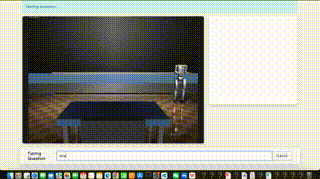
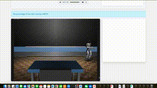
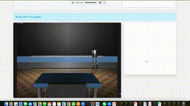

# CS440 Teaching Robot Project

An embodied teaching robot that can walk, write, and perform speaking-related gestures in a virtual classroom environment. This project integrates reinforcement learning, robot control, and interactive visualization to emulate natural teaching behaviors.

## Demo Preview

<table>
  <tr>
    <td align="center">
        <br/>
        Speaking with Gestures
      </a>
    </td>
    <td align="center">
        <br/>
        Walking & Turning
      </a>
    </td>
    <td align="center">
        <br/>
        Writing on Blackboard
      </a>
    </td>

  </tr>
</table>

## Features

- **Walking Module**: Utilizes reinforcement learning to enable autonomous walking.
- **Writing Module**: Employs inverse kinematics to translate text into blackboard writing motions.
- **Gesture Module**: Incorporates forward kinematics to synchronize gestures with speech.
- **Virtual Classroom**: Simulates a traditional classroom setting with a blackboard, teacher’s desk, and student seating.
- **Web-Based Visualization**: Real-time visualization using Flask, Bootstrap, and Socket.IO.


## ⚙️ Installation (macOS + Conda)

### 1. Clone the Repository

```bash
git clone https://github.com/Jiafeng9/cs440_project.git
cd cs440_project
```

### 2. Create and Activate Conda Environment

```bash
conda create -n cs440 python=3.10
conda activate cs440
```

### 3. Install Python Dependencies

```bash
pip install -r requirements.txt
```

### 4. Set Up External Directory and Clone Dependencies

Create an external directory to house the required external repositories:

```bash
mkdir outside_project
cd outside_project
```

#### Clone Unitree RL Gym

```bash
git clone https://github.com/unitreerobotics/unitree_rl_gym
cd unitree_rl_gym
# Follow their README to build the simulation backend (IsaacGym/MuJoCo)
cd ..
```

#### Clone PantoMatrix (for speaking motion)

```bash
git clone https://github.com/PantoMatrix/PantoMatrix
# Follow setup instructions for animation inference
```

#### Install MuJoCo

Ensure MuJoCo is installed and licensed as per their [official documentation](https://mujoco.org/).

## 🚀 Usage

### 1. Start Simulation and Web Frontend

From the `cs440_project` directory:

```bash
python server/app.py
```

Then, open your browser and navigate to:

```
http://127.0.0.1:6006
```

The robot will launch into the classroom, where it can walk, write on the blackboard, and perform gestures while “speaking”.

## 🗂️ Project Structure

```plaintext
cs440_project/
├── mujoco_models/           # MuJoCo XML files (e.g., classroom.xml)
├── server/                  # Flask backend
│   ├── app.py               # Entry point
│   └── simulator.py         # MuJoCo interface
├── frontend/                # HTML + JS + Bootstrap
├── rl_module/               # Policy logic, configs
├── panto_adapter/           # Gesture animation modules
├── static/                  # Assets
└── requirements.txt
```

## 📦 Acknowledgments

- [Unitree Robotics](https://github.com/unitreerobotics/unitree_rl_gym)
- [PantoMatrix](https://github.com/PantoMatrix/PantoMatrix)
- [MuJoCo Physics Engine](https://mujoco.org/)
- [Flask Web Framework](https://flask.palletsprojects.com/)
- [Bootstrap](https://getbootstrap.com/)
- [Flask-SocketIO](https://flask-socketio.readthedocs.io/)

## 📄 License

MIT License © Jiafeng9 2025
